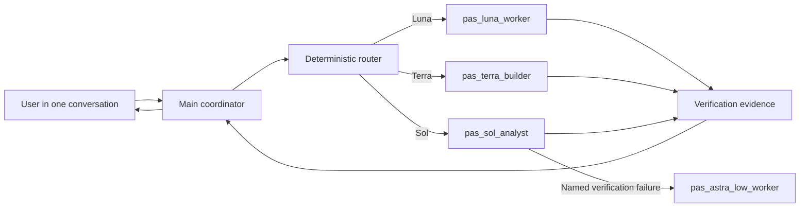

# Codex Model Router

[](https://github.com/capitalparser/codex-model-router/actions/workflows/ci.yml)
[](LICENSE)
[](https://www.python.org/)

Codex Model Router is a repository-scoped skill and custom-agent package for using GPT-5.6 Luna, Terra, Sol, and GPT-6 Astra intentionally inside one visible Codex conversation.

The main conversation stays in control of requirements, approvals, and final integration. Bounded planning, implementation, test, and QA slices can be delegated automatically to model-specific workers. The router does not silently switch the model of the active conversation.

## Why this exists

Picking one expensive model for an entire coding task is simple but wasteful. Picking a cheaper model for everything is fast until the task needs architectural judgment or high-risk review. This package separates orchestration from execution:

- GPT-5.6 Sol handles deep architecture, ambiguity, and high-failure-cost QA.
- GPT-5.6 Terra handles everyday implementation, integration, and moderately complex debugging.
- GPT-5.6 Luna handles repeatable, validator-backed, high-volume, and deterministic test work.
- GPT-6 Astra is a final, evidence-gated escalation tier for genuinely difficult or high-consequence work after Sol.

The choice is not made from phase names alone. A difficult test investigation may need Sol; a mechanical planning inventory may need Luna. The deterministic advisor considers verifiability, failure cost, volume, depth, decomposability, and verified historical outcomes.

## Architecture



The main coordinator keeps the conversation context. Workers receive bounded prompts with exact mutable paths, acceptance criteria, and verification commands. Their results return to the coordinator, which checks evidence before proceeding.

## Installation

### Repository-scoped installation

Copy the skill and project-agent directories into the target repository:

```text
your-repository/
├── .agents/
│   └── skills/
│       └── codex-model-router/
└── .codex/
    └── agents/
        ├── pas_luna_worker.toml
        ├── pas_terra_worker.toml
        ├── pas_terra_builder.toml
        ├── pas_sol_analyst.toml
        ├── pas_sol_max_worker.toml
        ├── pas_astra_low_worker.toml
        ├── pas_astra_medium_worker.toml
        └── pas_astra_high_worker.toml
```

From a checkout of this package:

```bash
mkdir -p /path/to/your-repository/.agents/skills
mkdir -p /path/to/your-repository/.codex/agents

cp -R .agents/skills/codex-model-router \
  /path/to/your-repository/.agents/skills/
cp .codex/agents/pas_*.toml \
  /path/to/your-repository/.codex/agents/
```

Start a new Codex task in the repository after installation so skill and custom-agent discovery reloads.

### Personal installation

For use across repositories, copy the skill to `${CODEX_HOME:-$HOME/.codex}/skills/codex-model-router`. Copy the agent TOML files to `${CODEX_HOME:-$HOME/.codex}/agents/`.

Repository-scoped installation is recommended first. It keeps policy, custom workers, and outcome behavior reviewable with the codebase that uses them.

### Requirements

- A current Codex CLI or Codex application with GPT-5.6 Sol, Terra, Luna, and (for Astra escalation) GPT-6 Astra available to the signed-in account.
- Tested with Codex CLI `0.144.4`; newer releases should be revalidated when model slugs or custom-agent schema change.
- Python 3.9 or newer for the advisor.
- Native custom-agent support for the preferred dispatch path.
- `codex exec` for the explicit fallback path.

Check the local model catalog:

```bash
codex debug models
```

## Triggering the router

Invoke it explicitly:

```text
Use $codex-model-router to plan, implement, test, and independently QA this change with suitable GPT-5.6 workers.
```

The skill metadata also allows implicit triggering when a substantial request needs deliberate model selection, automatic phase delegation, evidence-based escalation, or cost/quality balancing.

For deterministic inspection without running a worker:

```bash
python3 .agents/skills/codex-model-router/scripts/advisor.py dispatch \
  --task-family feature-build \
  --phase build \
  --task-scope phase \
  --verifiable yes \
  --failcost mid \
  --volume mid \
  --depth deep \
  --parent-sandbox workspace-write \
  --exec-sandbox workspace-write \
  --parent-approval-policy on-request \
  --approval-boundary-confirmed
```

For a structured task card, classify locally before recommending or dispatching. Classification reads only the supplied file, returns signal labels rather than task prose, and uses conservative floors when confidence is low:

```bash
python3 .agents/skills/codex-model-router/scripts/advisor.py classify \
  --task-file .github/CODEX_TASK.md
python3 .agents/skills/codex-model-router/scripts/advisor.py dispatch-from-task \
  --task-file .github/CODEX_TASK.md --phase build --task-scope phase
```

`classify` does not choose a model or launch a worker. It derives the existing axes from validation evidence, sensitive-change and concurrency signals, allowed-path spread, and explicitly independent workstreams. The normal advisor remains the routing authority; existing explicit-axis `recommend` and `dispatch` commands remain supported.

The JSON result includes the model, effort, policy rule, custom-agent name, whether delegation is required, supported dispatch modes, and `codex_exec_ready`. The executable fallback command is withheld unless the parent sandbox and approval policy are explicit, the child sandbox is the same or stricter, and the coordinator confirms the boundary. It passes the exact parent approval policy to the child command instead of relying on user defaults.

## How automatic routing works

For a typical multi-phase request, the coordinator repeats the following loop:

1. Classify the next bounded phase.
2. Run the deterministic `dispatch` command.
3. For `task_scope=micro`, execute directly in the main task.
4. Otherwise prefer the returned project custom agent.
5. If native agent selection is unavailable, confirm the parent approval policy and request the same or stricter sandbox.
6. Launch a bounded `codex exec` child only when `codex_exec_ready=true`.
7. Compare the returned changed paths and actual diff with the allowed mutable paths; reject out-of-scope results.
8. Collect commands, exit codes, verification evidence, and unresolved gaps.
9. Record the actual execution after verification.

Example outcome:

```text
Main conversation: GPT-5.6 Sol coordinator
Plan:             pas_sol_analyst / Sol high
Build:            pas_terra_builder / Terra high
Tests:            pas_luna_worker / Luna medium
Independent QA:   pas_sol_analyst / Sol high
```

The active conversation still reports its original model. Only the bounded child workers use different models.

## Dispatch modes

| Mode | Meaning |
|---|---|
| `native_custom_agent` | The current Codex surface launched a project agent whose fixed model and effort exactly match the recommendation. |
| `codex_exec` | The coordinator launched an explicit headless child with `-m`, effort, the exact parent approval policy, and a confirmed same-or-stricter sandbox. |
| `main_task_direct` | A micro task stayed in the main conversation because worker startup cost exceeded the benefit. |
| `main_task_fallback` | No model-specific child mechanism was available; the coordinator continued and disclosed the gap. |

Never report `native_custom_agent` merely because the policy recommended an agent. The dispatch mode describes what actually executed.

## Routing axes

| Axis | Values | Question |
|---|---|---|
| `verifiable` | `yes`, `partial`, `no` | Can a deterministic check establish success? |
| `failcost` | `low`, `mid`, `high` | What is the cost of a wrong result? |
| `volume` | `low`, `mid`, `high` | Is this repeated or large-scale work? |
| `depth` | `shallow`, `medium`, `deep` | How much cross-file or domain reasoning is required? |
| `decomposable` | `yes`, `no` | Can workstreams be verified independently? |
| `workstreams` | integer | How many independent workstreams exist? |

`phase` and `task_scope` control execution shape. They do not replace the reasoning axes.

## Evidence and outcome registry

When the skill is inside a repository tree that contains `Harness/`, the default registry is:

```text
Harness/sink/model_effort_router/outcomes.jsonl
```

Without a `Harness/` ancestor, the fallback is `~/.codex/state/codex-model-router/outcomes.jsonl`. That location is shared across repositories. Public installs should set `CODEX_MODEL_ROUTER_REGISTRY` to a repository-local ignored path when cross-repository history is undesirable.

Record a verified worker result:

```bash
python3 .agents/skills/codex-model-router/scripts/advisor.py record \
  --task-family feature-build \
  --axes-json '{"verifiable":"yes","failcost":"mid","volume":"mid","depth":"deep","decomposable":"no","workstreams":1}' \
  --model gpt-5.6-terra \
  --effort high \
  --phase build \
  --agent-name pas_terra_builder \
  --dispatch-mode native_custom_agent \
  --outcome verified_pass \
  --verification-command 'pytest -q' \
  --verification-result '28 passed'
```

History overrides static policy only for a registered exact model-effort agent when the same task family, axes, phase, and model generation have at least two recent verified passes and no verified failure. Astra xhigh/max, Max, Ultra, and legacy unregistered combinations are never eligible for automatic override. A verified failure moves the next dispatch away from the failed combination through a bounded escalation chain. Records older than the configured TTL are ignored.

## Escalation

Escalate from observed failure, not intuition:

- Attach the failed command and result to the next worker.
- Move one policy tier at a time.
- Stop if the same failure repeats without new evidence.
- Do not substitute higher reasoning effort for missing permissions, authority, requirements, or domain sources.

The static policy remains Luna/Terra/Sol. A named Sol High verification failure moves through Astra Low, Astra Medium, then Astra High; a further Astra High failure blocks dispatch. Astra xhigh/max and Ultra are never selected automatically and remain explicit/manual-only options.

## Safety boundaries

- The router does not silently switch the active conversation model.
- Workers must honor exact mutable paths and preserve unrelated changes.
- The coordinator rejects a worker result when its reported paths or actual diff exceed the allowed mutable paths.
- A `codex exec` worker runs only after explicit boundary confirmation with a same-or-stricter sandbox and the exact parent approval policy.
- The fallback command pins the supplied parent approval policy; it never silently substitutes a user-default child policy.
- Write-dependent phases run sequentially.
- Parallel writes to overlapping paths are prohibited.
- A recommendation is not proof that a model executed.
- The registry rejects unsupported field names such as `raw_prompt`, but it does not semantically detect secrets or personal data inside allowed text fields. Privacy is operator-enforced: use short, single-line, non-sensitive command/result summaries and never include client names, credentials, confidential text, or source documents.
- Session identity comes only from runtime-provided environment variables; otherwise it is `unknown`.
- The router never guesses the current task by scanning the globally newest rollout.
- Commits, pushes, deployments, publishing, and external messages retain their normal approval requirements.

## Limitations

- Native model-specific custom-agent selection varies by Codex surface and version.
- On surfaces without that capability, the package uses a separate `codex exec` child rather than changing the active task model.
- Child workers have separate execution contexts even though the user remains in one visible coordinator conversation.
- The router cannot repair missing authority or ambiguous product decisions.
- Model availability and supported reasoning levels depend on the account and current model catalog.
- This package does not include a scheduler, autonomous workflow engine, or recursive delegation controller.

## CLI reference

```bash
python3 .agents/skills/codex-model-router/scripts/advisor.py --help
python3 .agents/skills/codex-model-router/scripts/advisor.py dispatch --help
python3 .agents/skills/codex-model-router/scripts/advisor.py record --help
python3 .agents/skills/codex-model-router/scripts/advisor.py query --help
python3 .agents/skills/codex-model-router/scripts/advisor.py session
```

## Testing

Run the Python contract suite:

```bash
python3 -m unittest discover \
  -s .agents/skills/codex-model-router/tests \
  -v
```

Validate the skill metadata:

```bash
uv run --with pyyaml python \
  "$HOME/.codex/skills/.system/skill-creator/scripts/quick_validate.py" \
  .agents/skills/codex-model-router
```

Validate agent TOML against the current model catalog with Python 3.12 `tomllib` and `codex debug models`. The repository's tests also check required safety language and public README sections.

## Repository layout

```text
.agents/skills/codex-model-router/
├── SKILL.md
├── README.md
├── agents/openai.yaml
├── references/policy.json
├── scripts/advisor.py
└── tests/
    ├── test_advisor.py
    └── test_package_contract.py

.codex/agents/
├── pas_luna_worker.toml
├── pas_terra_worker.toml
├── pas_terra_builder.toml
├── pas_sol_analyst.toml
├── pas_sol_max_worker.toml
├── pas_astra_low_worker.toml
├── pas_astra_medium_worker.toml
└── pas_astra_high_worker.toml
```

## Release hygiene

Before publishing a release:

1. Preserve both `.agents/` and `.codex/` directory trees.
2. Keep the MIT license and copyright notice with redistributed copies.
3. Run the complete test and model-catalog validation commands.
4. Remove local registries, session logs, and private Harness artifacts from the release.
5. Document the minimum tested Codex CLI version and refresh it when model slugs or custom-agent schema change.

This project is released under the [MIT License](LICENSE). Security issues should follow [SECURITY.md](SECURITY.md).
